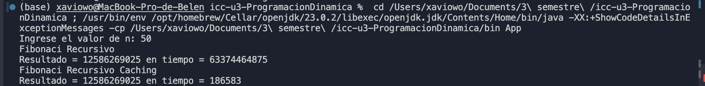
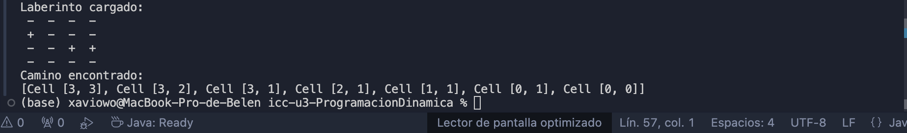

# 📘 Programación Dinámica - Fibonacci y Laberinto

**Carrera:** Computación  
**Asignatura:** Estructura de Datos  
**Práctica:** Programación Dinámica
**Estudiante:** *Erika Collaguazo*  
**Docente:** Ing. Pablo Torres  

## Resultados Fibonacci

## Resultados Laberintos
